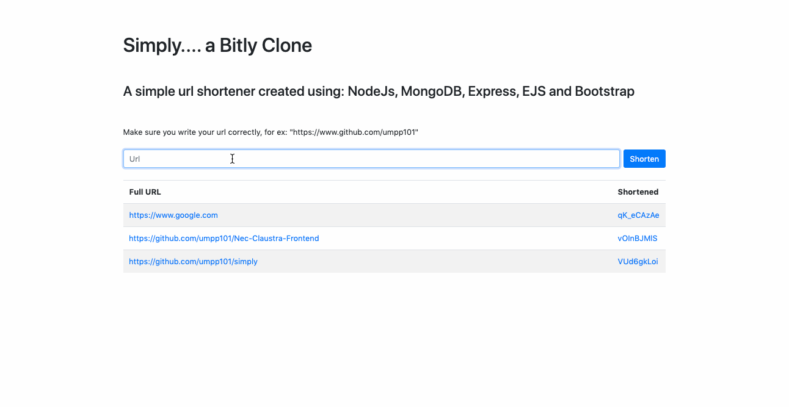

  
   
   

## Table of content
- [About](#about)
- [Usage](#usage)
- [TechsUsed](#TechsUsed)

## About
`Bitly Clone: Url Shortener built with the MERN Stack`

Simply, is a React web app:
that shortens website links for you.

I created this app with there MERN stack while utilizing the ShortId npm package to shorten the links and render shortened links on to the homepage using Ejs

## Usage
- Clone the repository
- Inside your local directory run `npm install` to install required dependencies
- Use `npm start` command to run the application
- run on localhost:5000

## TechsUsed
- MongoDB
- Express
- NodeJs
- EJS

